# DO5_SimpleDocker
## Part 1:
1. docker pull nginx

    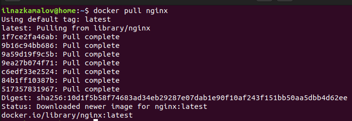
     

2.  docker images

    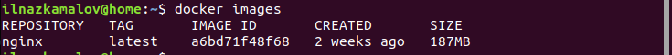
     

3. docker run -d nginx

    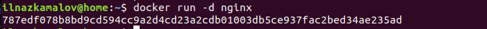

    - -d (detach) - это флаг, который указывает Docker на запуск контейнера в фоновом режиме (detached mode). Это означает, что контейнер будет работать в фоновом режиме, и командная строка будет освобождена для дальнейшего использования.
     

4. docker ps

    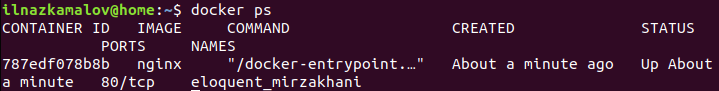
     

5. docker inspect

    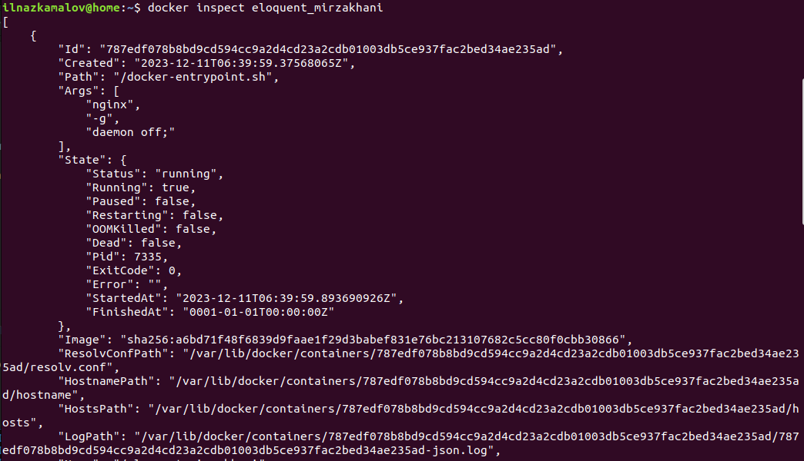
     

6. По выводу команды определить и поместить в отчёт размер контейнера, список замапленных портов и ip контейнера

    - Размер контейнера
    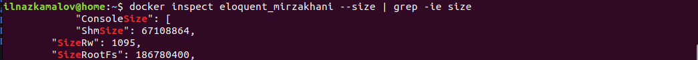
     

    - Список замапленых портов
    
     

    - IP контейнера
    
     

7. Остановить докер образ через docker stop. Проверить, что образ остановился через docker ps

    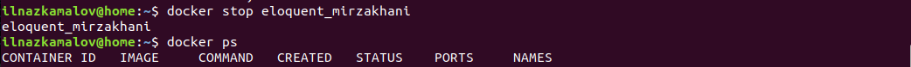
     

8. Запустить докер с портами 80 и 443 в контейнере, замапленными на такие же порты на локальной машине, через команду run

    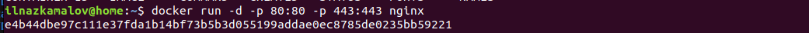
     

9. Проверить, что в браузере по адресу localhost:80 доступна стартовая страница nginx

    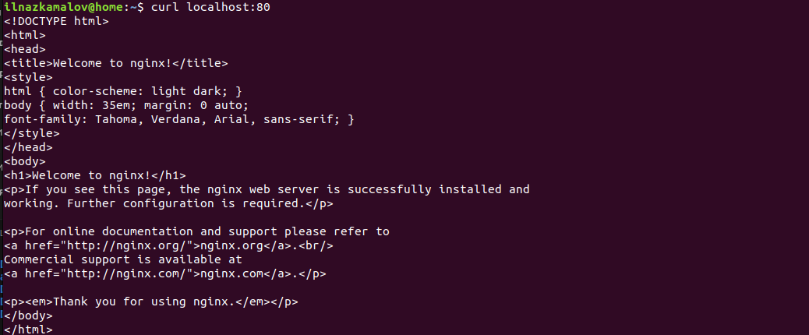
     

## Part 2. Операции с контейнером

1. Прочитать конфигурационный файл nginx.conf внутри докер контейнера через команду exec

    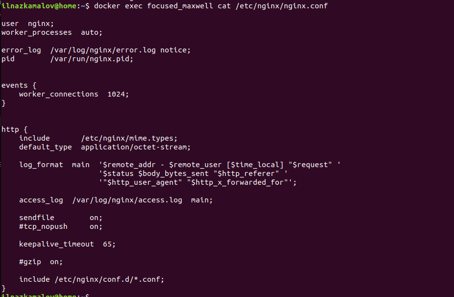
     

2. Создать на локальной машине файл nginx.conf. Настроить в нем по пути /status отдачу страницы статуса сервера nginx

    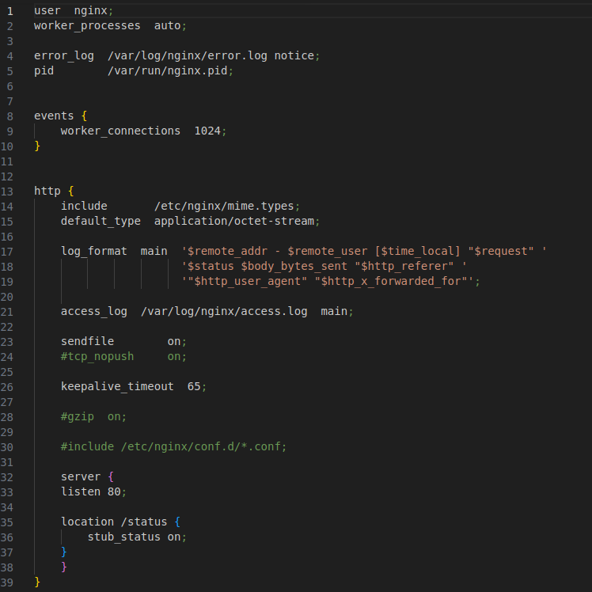
     

3. Скопировать созданный файл nginx.conf внутрь докер образа через команду docker cp
    
    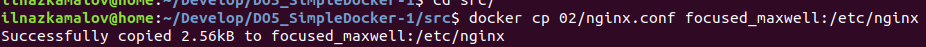
     

4. Перезапустить nginx внутри докер образа через команду exec
    
    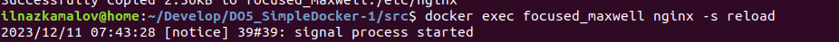
     

5. Проверить, что по адресу localhost:80/status отдается страничка со статусом сервера nginx

    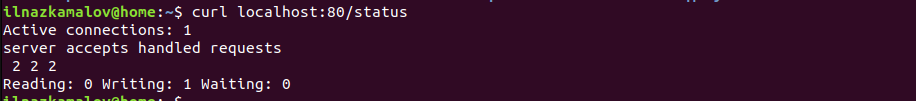
     

6. Экспортировать контейнер в файл container.tar через команду export. Остановить контейнер

    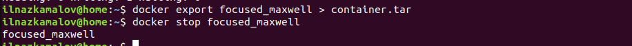
     

7. Удалить образ через docker rmi не удаляя перед этим контейнеры

    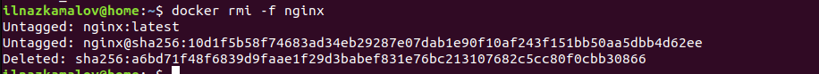
     

8. Удалить остановленный контейнер

    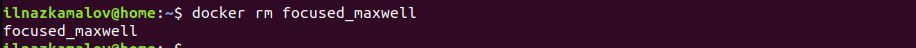
     

9. Импортировать контейнер обратно через команду import. Запустить импортированный контейнер

    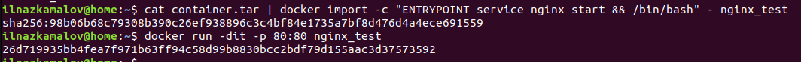
     

10. Проверить, что по адресу localhost:80/status отдается страничка со статусом сервера nginx

    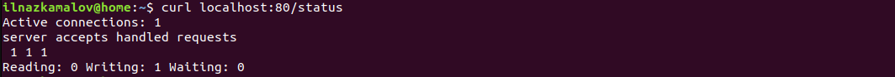
     

## Part 3. Мини веб-сервер

1. Написать мини сервер на C и FastCgi, который будет возвращать простейшую страничку с надписью Hello World!
    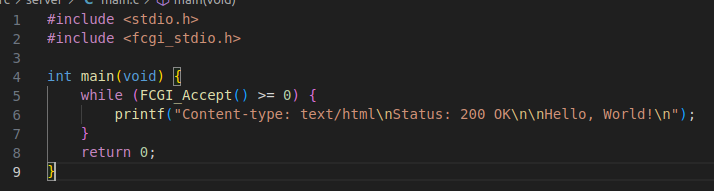
     

2. Написать свой nginx.conf, который будет проксировать все запросы с 81 порта на 127.0.0.1:8080
    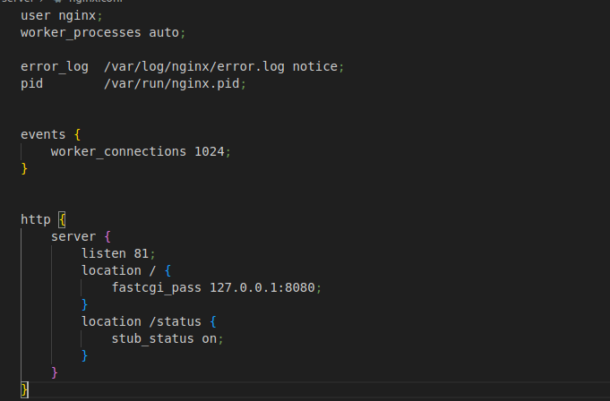
     

3. Запуск:

    - Теперь выкачаем новый docker-образ и на его основе запустим новый контейнер
    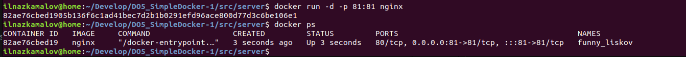

    - После перекинем конфиг и логику сервера в новый контейнер
    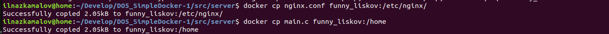

    - Затем установим требуемые утилиты для запуска мини веб-сервера на FastCGI, в частности spawn-fcgi и libfcgi-dev
    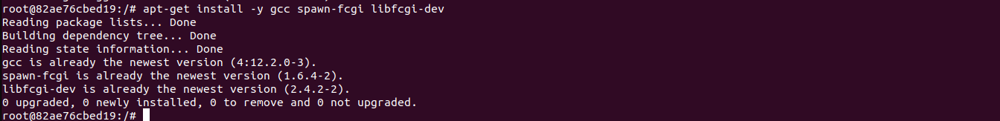

    - компилируем и запустим наш мини веб-сервер через команду spawn-fcgi на порту 8080
    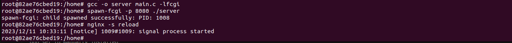

    - проверим:
    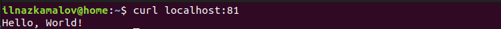
     

## Part 4. Свой докер

### Написать свой докер образ, который:
1. собирает исходники мини сервера на FastCgi из Части 3
2. запускает его на 8080 порту
3. копирует внутрь образа написанный ./nginx/nginx.conf
4. запускает nginx.

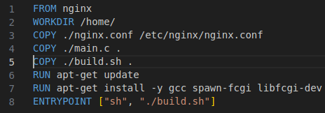
 

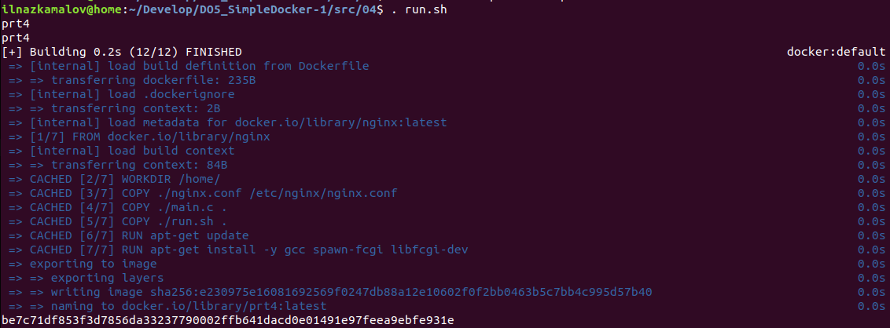
 

- Проверяем
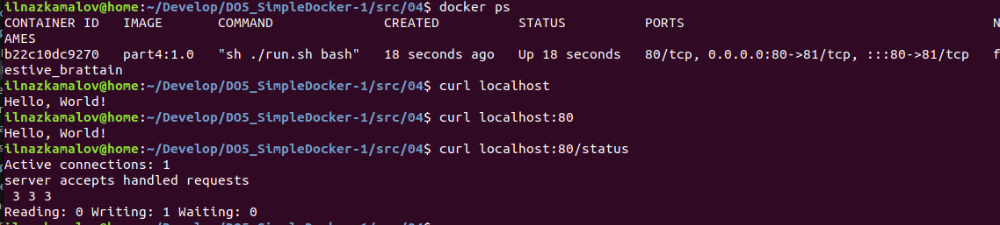

## Part 5. Dockle
### Просканировать образ из предыдущего задания через dockle 
### Исправить образ так, чтобы при проверке через dockle не было ошибок и предупреждений

- скачиваем Dockle
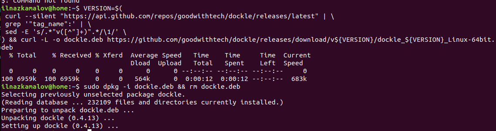

- Создаем скрипт для создания сервера и его проверки
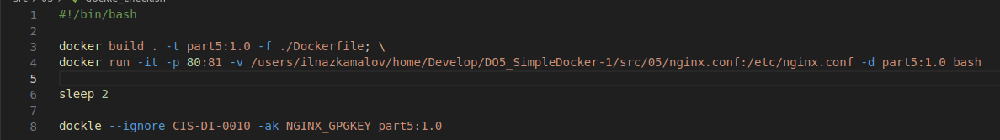

- запускаем скрипт:
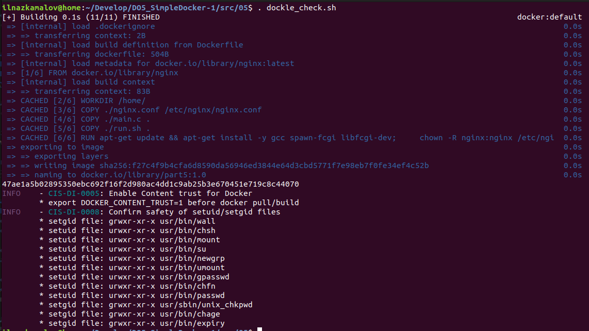

## Part 6. Базовый Docker Compose
### Написать файл docker-compose.yml, с помощью которого:
1. Поднять докер контейнер из Части 5 (он должен работать в локальной сети, т.е. не нужно использовать инструкцию EXPOSE и мапить порты на локальную машину)

2. Поднять докер контейнер с nginx, который будет проксировать все запросы с 8080 порта на 81 порт первого контейнера

- Проверим, что все контейнеры выключены и запустим сборку через команду docker-compose build
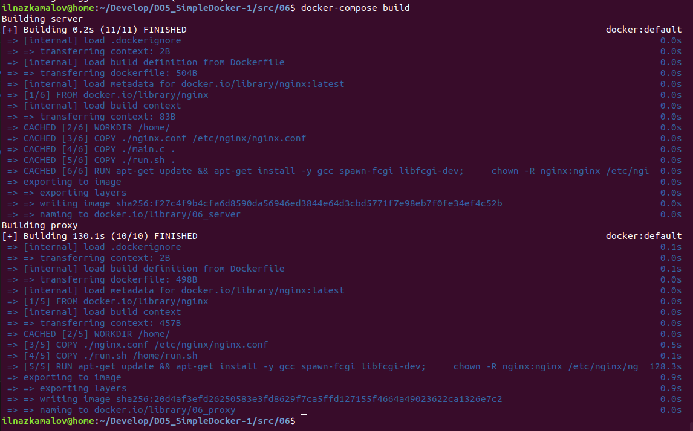

- Поднимаем контейнер командой docker-compose up и проверяем сервер:
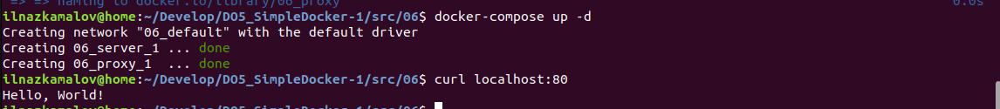
